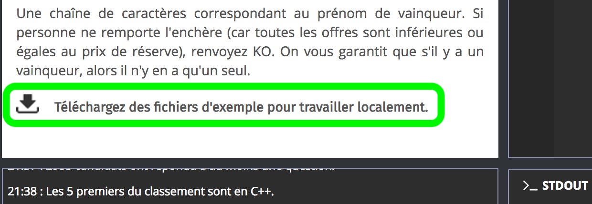
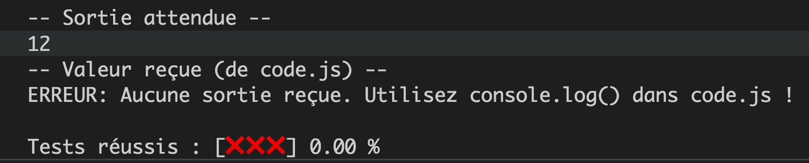
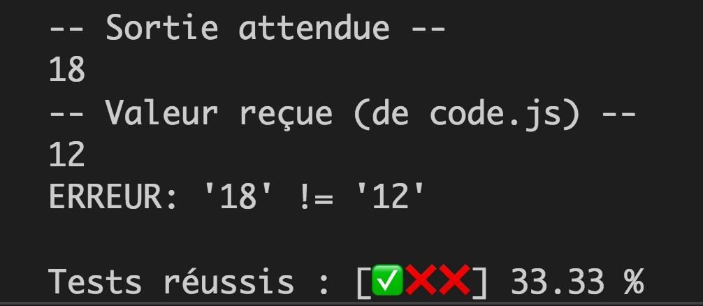
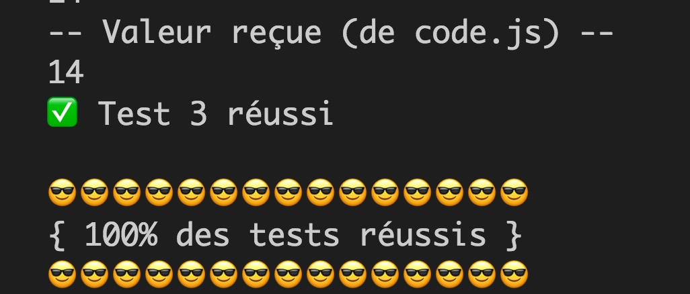
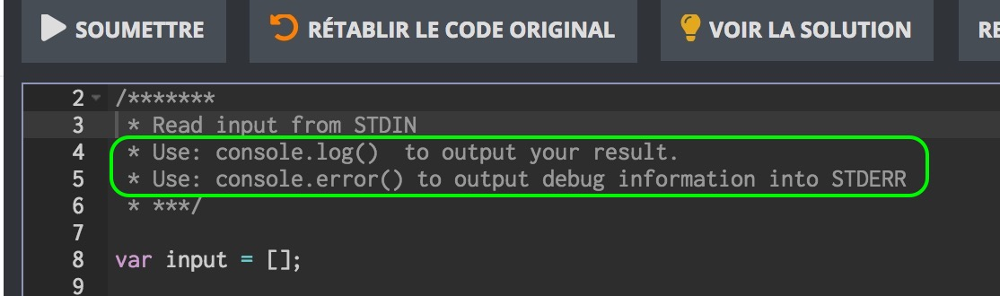

# Faites les exercices de la Battle Dev depuis Visual Studio Code !

Ce script NodeJS vous permet de faire et de tester les exercices de la [Battle Dev](https://battledev.blogdumoderateur.com/) directement depuis VSCode.

Il s'appuie sur les fichiers d'exemple fournis lors de la Battle Dev pour coder en local les réponses aux exercices.



## Quel intérêt ?

L'éditeur fourni lors de la Battle Dev ne permet pas de déboguer et est très sommaire. C'est beaucoup plus confortable de coder dans son IDE préféré avec toutes les extensions qui facilitent le développement.

## Comment ça marche ?

Lors de la prochaine Battle, il vous suffira de suivre les étapes suivantes pour faire un exercice :

1. Téléchargez le fichier ZIP d'exemple et décompressez son contenu dans le dossier `tests` (ça devrait être un ensemble de fichiers nommés `input1.txt`, `input2.txt` etc. et `output1.txt`, `output2.txt` etc.).
2. Développez le code répondant à l'exercice dans la fonction `ContestResponse` du fichier `code.js` :

```javascript
// -- Coller votre code dans la fonction ContestResponse ci-après
function ContestResponse() {
  // Implémentez votre code ci-dessous
}
// -- Fin du code à tester
```

3. Affichez vos réponses en utilisant `console.log`.
4. Lancez le script node `run.js` depuis VSCode (raccourci clavier CTRL+F5 ou F5 pour déboguer).
5. Vérifier le résultat dans la console de débogage.
6. Si tous les tests passent, vous pouvez copier-coller votre code (contenu dans `ContestResponse` + vos fonctions) dans l'éditeur du Battle Dev et valider. Sinon retournez à l'étape 2.
7. Supprimez votre code dans `code.js`, supprimez tous les fichiers dans le dossier `tests`. Passez à l'exercice suivant et retournez à l'étape 1.

## Affichage des résultats

Le script affiche pour chaque exercice les valeurs d'entrée, les valeurs de sortie attendues (en général juste une ligne) et les valeurs reçues de la part de votre code.

Aucun test réussi : 
Certains tests (ici 1) réussis : 
Tous les tests réussis : 

## Adaption du code le jour J

Je me suis basé sur le fonctionnement de l'éditeur du dernier Battle Dev datant de Novembre 2018.

Il se peut que des modifications aient été apportées pour la prochaine édition et qu'il faille par exemple changer l'instruction permettant d'afficher le résultat (`console.log`) ou d'afficher les infos de débogage (`console.error`).

> Prenez le temps de vous approprier le code pour être capable de le modifier rapidement si besoin le jour J !

Vérifiez la façon dont vous devrez soumettre vos résultats en regardant en haut de l'éditeur :



Changez ce qui est nécessaire dans le script pour que ça fonctionne.

## Tests du script

J'ai testé le script avec tous les exercices possédant des solutions en JavaScript provenant des saisons 11 et 12 de la Battle Dev.

Les exercices 5 et 6 de la saison 11 et les exercices 4,5 et 6 de la saison 12 ne possédant pas de solutions en JavaScript je ne les ai pas testé avec mon script.

## Exercices des années précédentes

J'ai compilé pour vous les énoncés (sans les images) et tous les fichiers de test des saisons 11 et 12 de la Battle Dev dans le dossier `exercices`.

Vous pouvez les utiliser pour vous entraîner !

Pour ce faire rien de plus simple. Supposons que vous vouliez faire l'exercice 2 de la saison 12.

Copiez tous les fichiers du dossier `Exercice 2 - Mots magiques` dans `tests`. Vous pouvez inclure `enonce.txt`, ce n'est pas gênant pour le script. Vous êtes prêt à coder comme expliqué dans la section [comment ça marche](#comment-ça-marche).

## Vous aimez ? Partagez ce dépôt !

N'hésitez pas à partager ce dépôt sur les réseaux sociaux et à cliquer l'étoile en haut à droite si vous appréciez ce script.

Vous pouvez également me faire un petit coucou sur Twitter : [@JeremyMouzin](https://twitter.com/jeremymouzin).

Notez également que je streamerai en live ma participation à la Battle Dev dans un but pédagogique le 26 Mars 2019 à 20h sur [ma chaîne YouTube](https://www.youtube.com/channel/UCMzJVrWeaKUotLPWTdx6HuQ).

## Je code en Français, voici pourquoi

Dans un but pédagogique et pour donner accès à du code rédigé en Français aux non-anglophones, j'ai fait le choix de rédiger mon code source et mes commentaires en Français.

J'espère que les étudiants de [ma formation JavaScript](https://www.javascriptdezero.com) liront et comprendront le code source plus facilement comme ça.

Merci et à bientôt 😘.
